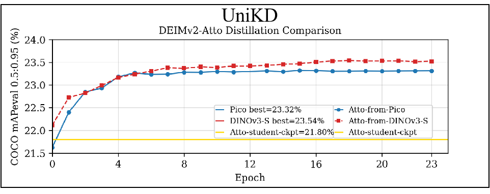

<h2 align="center">
  Real-Time Object Detection Meets DINOv3
</h2>

<p align="center">
    DEIMv2 is an evolution of the DEIM framework while leveraging the rich features from DINOv3. Our method is designed with various model sizes, from an ultra-light version up to S, M, L, and X, to be adaptable for a wide range of scenarios. Across these variants, DEIMv2 achieves state-of-the-art performance, with the S-sized model notably surpassing 50 AP on the challenging COCO benchmark.
</p>

---

  

<p align="center">
<strong>If you like our work, please give us a ⭐!</strong>
</p>


<p align="center">
  
  
  
  

</p>

</details>

 
  
## 🚀 Updates
- [x] **\[2025.9.26\]** Release DEIMv2 series.

## Table of Content
* [1. Model Zoo](#1-model-zoo)
* [2. Quick Start](#2-quick-start)
* [3. Usage](#3-usage)
* [4. Tools](#4-tools)
* [5. DEIM-FGD Extensions](#5-deim-fgd-extensions)
* [6. Citation](#6-citation)
* [7. Acknowledgement](#7-acknowledgement)
  
  
## 1. Model Zoo
暂定


## 2. Quick start

### Setup

```shell
conda create -n deimv2 python=3.11 -y
conda activate deimv2
pip install -r requirements.txt
```


### Data Preparation

<details>
<summary> COCO2017 Dataset </summary>

1. Download COCO2017 from [OpenDataLab](https://opendatalab.com/OpenDataLab/COCO_2017) or [COCO](https://cocodataset.org/#download).
1. Modify paths in [coco_detection.yml](./configs/dataset/coco_detection.yml)

    ```yaml
    train_dataloader:
        img_folder: /data/COCO2017/train2017/
        ann_file: /data/COCO2017/annotations/instances_train2017.json
    val_dataloader:
        img_folder: /data/COCO2017/val2017/
        ann_file: /data/COCO2017/annotations/instances_val2017.json
    ```

</details>

<details>
<summary>Custom Dataset</summary>

To train on your custom dataset, you need to organize it in the COCO format. Follow the steps below to prepare your dataset:

1. **Set `remap_mscoco_category` to `False`:**

    This prevents the automatic remapping of category IDs to match the MSCOCO categories.

    ```yaml
    remap_mscoco_category: False
    ```

2. **Organize Images:**

    Structure your dataset directories as follows:

    ```shell
    dataset/
    ├── images/
    │   ├── train/
    │   │   ├── image1.jpg
    │   │   ├── image2.jpg
    │   │   └── ...
    │   ├── val/
    │   │   ├── image1.jpg
    │   │   ├── image2.jpg
    │   │   └── ...
    └── annotations/
        ├── instances_train.json
        ├── instances_val.json
        └── ...
    ```

    - **`images/train/`**: Contains all training images.
    - **`images/val/`**: Contains all validation images.
    - **`annotations/`**: Contains COCO-formatted annotation files.

3. **Convert Annotations to COCO Format:**

    If your annotations are not already in COCO format, you'll need to convert them. You can use the following Python script as a reference or utilize existing tools:

    ```python
    import json

    def convert_to_coco(input_annotations, output_annotations):
        # Implement conversion logic here
        pass

    if __name__ == "__main__":
        convert_to_coco('path/to/your_annotations.json', 'dataset/annotations/instances_train.json')
    ```

4. **Update Configuration Files:**

    Modify your [custom_detection.yml](./configs/dataset/custom_detection.yml).

    ```yaml
    task: detection

    evaluator:
      type: CocoEvaluator
      iou_types: ['bbox', ]

    num_classes: 123 # your dataset classes
    remap_mscoco_category: False

    train_dataloader:
      type: DataLoader
      dataset:
        type: CocoDetection
        img_folder: /data/yourdataset/train
        ann_file: /data/yourdataset/train/train.json
        return_masks: False
        transforms:
          type: Compose
          ops: ~
      shuffle: True
      num_workers: 4
      drop_last: True
      collate_fn:
        type: BatchImageCollateFunction

    val_dataloader:
      type: DataLoader
      dataset:
        type: CocoDetection
        img_folder: /data/yourdataset/val
        ann_file: /data/yourdataset/val/ann.json
        return_masks: False
        transforms:
          type: Compose
          ops: ~
      shuffle: False
      num_workers: 4
      drop_last: False
      collate_fn:
        type: BatchImageCollateFunction
    ```

</details>

### Backbone Checkpoints

For DINOv3 S and S+, download them following the guide in https://github.com/facebookresearch/dinov3

For our distilled ViT-Tiny and ViT-Tiny+, you can download them from [ViT-Tiny](https://drive.google.com/file/d/1YMTq_woOLjAcZnHSYNTsNg7f0ahj5LPs/view?usp=sharing) and [ViT-Tiny+](https://drive.google.com/file/d/1COHfjzq5KfnEaXTluVGEOMdhpuVcG6Jt/view?usp=sharing).

Then place them into ./ckpts as:

```shell
ckpts/
├── dinov3_vits16.pth
├── vitt_distill.pt
├── vittplus_distill.pt
└── ...
```


## 3. Usage
<details open>
<summary> COCO2017 </summary>

1. Training
```shell
# for HGNetv2-based-from-HGNetv2-based variants
CUDA_VISIBLE_DEVICES=0,1,2,3 torchrun --master_port=1235 --nproc_per_node=4   train.py   -c configs/distill_deimv2/deimv2_hgnetv2_${model}_from_${model}_${backbone/encoder}_distill.yml   --use-amp --seed=1
# for HGNetv2-based-from-ViT-based variants
CUDA_VISIBLE_DEVICES=0,1,2,3 torchrun --master_port=1234 --nproc_per_node=4   train.py   -c configs/distill_deimv2_different/deimv2_hgnetv2_${model}_from_${model}_${backbone/encoder}_distill.yml   --use-amp --seed=1
```

<details>
<summary> Customizing Batch Size </summary>

For example, if you want to double the total batch size when training D-FINE-L on COCO2017, here are the steps you should follow:

1. **Modify your [dataloader.yml](./configs/base/dataloader.yml)** to increase the `total_batch_size`:

    ```yaml
    train_dataloader:
        total_batch_size: 64  # Previously it was 32, now doubled
    ```

2. **Modify your [deim_hgnetv2_l_coco.yml](./configs/deim_dfine/deim_hgnetv2_l_coco.yml)**. Here’s how the key parameters should be adjusted:

    ```yaml
    optimizer:
    type: AdamW
    params:
        -
        params: '^(?=.*backbone)(?!.*norm|bn).*$'
        lr: 0.000025  # doubled, linear scaling law
        -
        params: '^(?=.*(?:encoder|decoder))(?=.*(?:norm|bn)).*$'
        weight_decay: 0.

    lr: 0.0005  # doubled, linear scaling law
    betas: [0.9, 0.999]
    weight_decay: 0.0001  # need a grid search

    ema:  # added EMA settings
        decay: 0.9998  # adjusted by 1 - (1 - decay) * 2
        warmups: 500  # halved

    lr_warmup_scheduler:
        warmup_duration: 250  # halved
    ```

</details>


<details>
<summary> Customizing Input Size </summary>

If you'd like to train **DEIM** on COCO2017 with an input size of 320x320, follow these steps:

1. **Modify your [dataloader.yml](./configs/base/dataloader.yml)**:

    ```yaml

    train_dataloader:
    dataset:
        transforms:
            ops:
                - {type: Resize, size: [320, 320], }
    collate_fn:
        base_size: 320
    dataset:
        transforms:
            ops:
                - {type: Resize, size: [320, 320], }
    ```

2. **Modify your [dfine_hgnetv2.yml](./configs/base/dfine_hgnetv2.yml)**:

    ```yaml
    eval_spatial_size: [320, 320]
    ```

</details>

## 4. Tools
<details>
<summary> Deployment </summary>

<!-- <summary>4. Export onnx </summary> -->
1. Setup
```shell
pip install onnx onnxsim
```

2. Export onnx
```shell
python tools/deployment/export_onnx.py --check -c configs/deimv2/deimv2_dinov3_${model}_coco.yml -r model.pth
```

3. Export [tensorrt](https://docs.nvidia.com/deeplearning/tensorrt/install-guide/index.html)
```shell
trtexec --onnx="model.onnx" --saveEngine="model.engine" --fp16
```

</details>

<details>
<summary> Inference (Visualization) </summary>


1. Setup
```shell
pip install -r tools/inference/requirements.txt
```


<!-- <summary>5. Inference </summary> -->
2. Inference (onnxruntime / tensorrt / torch)

Inference on images and videos is now supported.
```shell
python tools/inference/onnx_inf.py --onnx model.onnx --input image.jpg  # video.mp4
python tools/inference/trt_inf.py --trt model.engine --input image.jpg
python tools/inference/torch_inf.py -c configs/deimv2/deimv2_dinov3_${model}_coco.yml -r model.pth --input image.jpg --device cuda:0
```
</details>

<details>
<summary> Benchmark </summary>

1. Setup
```shell
pip install -r tools/benchmark/requirements.txt
```

<!-- <summary>6. Benchmark </summary> -->
2. Model FLOPs, MACs, and Params
```shell
python tools/benchmark/get_info.py -c configs/deimv2/deimv2_dinov3_${model}_coco.yml
```

2. TensorRT Latency
```shell
python tools/benchmark/trt_benchmark.py --COCO_dir path/to/COCO2017 --engine_dir model.engine
```
</details>

<details>
<summary> Fiftyone Visualization  </summary>

1. Setup
```shell
pip install fiftyone
```
4. Voxel51 Fiftyone Visualization ([fiftyone](https://github.com/voxel51/fiftyone))
```shell
python tools/visualization/fiftyone_vis.py -c configs/deimv2/deimv2_dinov3_${model}_coco.yml -r model.pth
```
</details>

<details>
<summary> Others </summary>

1. Auto Resume Training
```shell
bash reference/safe_training.sh
```

2. Converting Model Weights
```shell
python reference/convert_weight.py model.pth
```
</details>


## 5. DEIM-FGD Extensions
We open-sourced knowledge-distillation recipes that marry FGD[Yang, 2021] with both DEIM and DEIMv2 while preserving each framework's native schedulers.

- **Config layout.** `configs/distill_deim_dfine/` hosts DFINE teachers supervising compact HGNetv2 students; `configs/distill_deim_rtdetr/` covers RT-DETR backbones; `configs/distill_deim_different/` stores cross-backbone transfer (e.g., PResNet-50 -> HGNetv2-B0); `configs/distill_deimv2/` and `configs/distill_deimv2_different/` provide native DEIMv2 pairings and heterogeneous DINOv3->HGNetv2 cases.
- **Feature alignment.** All YAMLs call the shared `DEIMFGDDistiller`, which applies 1x1 adapters, supports encoder/backbone sources, and schedules staged pairs (`c5/c4/c3` or `p5/p4/p3`).
- **Scheduled activation.** FGD begins only after Dense O2O copy-blend stops (e.g., `start_epoch: 148` for HGNetv2-N, `start_epoch: 60` for DINOv3-L) and ramps weights to suppress gradient spikes.
- **Warm-start support.** Optional `student_ckpt` entries let you reuse a pure DEIM/DEIMv2 checkpoint that already finished augmentation-heavy training, reducing the epochs needed for stable distillation.
- **Retuned coefficients.** We tune `alpha_fgd`, `beta_fgd`, `gamma_fgd`, and `lambda_fgd` to emphasize foreground cues while keeping background and relation terms bounded under Dense O2O.

Refer to the inline comments of each config for recommended teacher checkpoints and batch sizes.

## 6. Citation
If you use `UniKD` or its methods in your work, please cite the following BibTeX entries:
<details open>
<summary> bibtex </summary>

```latex
@article{zhang2025UniKD,
  title={UniKD: Unified Cross-Architecture Knowledge Distillation with Warm-Start Scheduling for Real-Time DETR Models},
  author={Zhang Hongye},
}


  
```
</details>

## 7. Acknowledgement
Our work is built upon [DEIM](https://github.com/Intellindust-AI-Lab/DEIM), [DEIMv2](https://github.com/Intellindust-AI-Lab/DEIMv2), [FGD](https://github.com/yzd-v/FGD),[D-FINE](https://github.com/Peterande/D-FINE), [RT-DETR](https://github.com/lyuwenyu/RT-DETR) and [DINOv3](https://github.com/facebookresearch/dinov3). Thanks for their great work!

✨ Feel free to contribute and reach out if you have any questions! ✨
